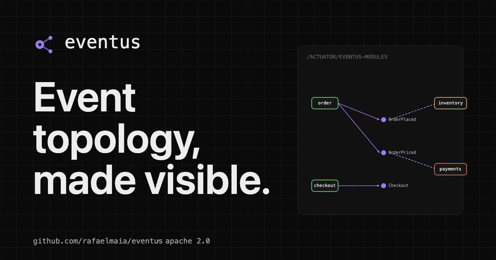

<p align="center">
  
</p>

<h1 align="center">Eventus</h1>

<p align="center"><strong>Event topology, made visible.</strong></p>

<p align="center">
  <a href="https://github.com/eventus-io/eventus/actions/workflows/build.yml"></a>
  <a href="https://github.com/eventus-io/eventus/actions/workflows/compatibility.yml"></a>
  <a href="https://central.sonatype.com/artifact/io.eventus/eventus-spring"></a>
  <a href="https://openjdk.org/projects/jdk/25/"></a>
  <a href="https://spring.io/projects/spring-boot"></a>
  <a href="LICENSE"></a>
</p>

<p align="center">
  Eventus extracts the event and module topology from your JVM application,
  materialises it as a live knowledge graph, and exposes it through actuator
  endpoints and an MCP server for LLM queries. A standalone React dashboard
  connects to those endpoints and can observe multiple services simultaneously,
  merging their graphs into one cross-service topology view.
</p>

<p align="center">
  
</p>

---

## Modules

| Module             | Description                                                                       |
|--------------------|-----------------------------------------------------------------------------------|
| `eventus-core`     | Framework-agnostic interfaces and in-memory backend                               |
| `eventus-spring`   | Spring Modulith extractor, actuator endpoints, impact analysis, violations, drift |
| `eventus-generic`  | Annotation-based extractor for plain JVM apps                                     |
| `eventus-streams`  | Spring Cloud Stream extractor (Kafka, RabbitMQ, etc.)                             |
| `eventus-mcp`      | MCP server exposing the graph as LLM-callable tools                               |
| `eventus-neo4j`    | Neo4j graph backend (optional persistence layer)                                  |

The dashboard lives in [`ui/`](ui/) as a standalone Vite + React application, independent of the Java build.

---

## Quick Start

Add `eventus-spring` to your Spring Modulith project:

```xml
<dependency>
  <groupId>io.eventus</groupId>
  <artifactId>eventus-spring</artifactId>
  <version>0.1</version>
</dependency>
```

Expose the endpoints in `application.properties`:

```properties
management.endpoints.web.exposure.include=*
```

Start your application. The graph API is immediately available:

```bash
curl http://localhost:8080/eventus/api/graph
curl http://localhost:8080/eventus/api/violations
curl http://localhost:8080/eventus/api/drift
```

Then start the dashboard (see [Dashboard](#dashboard) below) and point it at your service.

---

## REST API

| Endpoint                                   | Description                                              |
|--------------------------------------------|----------------------------------------------------------|
| `GET /eventus/api/graph`                   | Full topology (modules, events, edges, publications)     |
| `GET /eventus/api/impact/event/{eventId}`  | Modules affected if an event changes                     |
| `GET /eventus/api/impact/module/{moduleId}`| Events published by a module and downstream listeners    |
| `GET /eventus/api/violations`              | Detected topology violations (filterable by severity)    |
| `GET /eventus/api/drift`                   | Topology drift since last baseline                       |
| `POST /eventus/api/drift/baseline`         | Capture the current topology as baseline                 |

### Actuator endpoints

| Endpoint                             | Description                                   |
|--------------------------------------|-----------------------------------------------|
| `GET /actuator/eventus-modules`      | All modules with status and bean count        |
| `GET /actuator/eventus-events`       | All domain events with publisher info         |
| `GET /actuator/eventus-publications` | Incomplete and stale event publications       |

---

## Dashboard

The dashboard lives in [`ui/`](ui/) — a standalone Vite 5 + React 18 + TypeScript app that connects to one or more Eventus backends.

### Development

```bash
cd ui
npm install
npm run dev          # http://localhost:5173
```

The dev server proxies `/eventus/api` to `http://localhost:8080` by default. Set `VITE_API_URL` to override.

### Docker

```bash
cd ui
docker build -t eventus-ui .
docker run -p 80:80 -e EVENTUS_API_URL=http://my-service:8080 eventus-ui
```

`EVENTUS_API_URL` is injected at container start via nginx's template mechanism — no rebuild needed.

### Features

- **Graph view** — modules as nodes, event flows as edges; click any node to inspect published and consumed events
- **Multi-backend overlay** — connect the UI to multiple services simultaneously; each service gets a colour, cross-service events are highlighted as shared nodes linking the two graphs
- **Impact analysis** — which modules are affected if a specific event changes
- **Violations** — hidden couplings and missing dependency declarations
- **Drift detection** — topology changes since the last saved baseline
- **Publication log** — incomplete or stale transactional event publications

### Multi-backend setup

Open the **Backends panel** (top-right button) and add each service:

| Field | Example           |
|-------|-------------------|
| Name  | `payments`        |
| URL   | `http://host:8081`|

The dashboard polls all enabled backends every 2 seconds and merges their graphs. Events that appear in more than one service are rendered as **cross-service nodes** (grey fill, dashed ring) — making saga flows and shared domain events immediately visible.

---

## MCP Server

`eventus-mcp` exposes the graph as tools for LLM agents via the Model Context Protocol.

```xml
<dependency>
  <groupId>io.eventus</groupId>
  <artifactId>eventus-mcp</artifactId>
  <version>0.1</version>
</dependency>
```

Protect the `/mcp/**` endpoint with an API key:

```properties
eventus.mcp.security.enabled=true
eventus.mcp.security.api-key=your-secret-key
```

---

## Spring Cloud Stream

`eventus-streams` extracts producer/consumer topology from Spring Cloud Stream bindings — no code changes needed.

```xml
<dependency>
  <groupId>io.eventus</groupId>
  <artifactId>eventus-streams</artifactId>
  <version>0.1</version>
</dependency>
```

---

## Configuration

| Property                               | Default | Description                                        |
|----------------------------------------|---------|----------------------------------------------------|
| `eventus.enabled`                      | `true`  | Enable/disable Eventus entirely                    |
| `eventus.publications.stale-threshold` | `PT2H`  | Duration before an incomplete publication is stale |
| `eventus.mcp.enabled`                  | `true`  | Enable/disable the MCP server                      |
| `eventus.mcp.security.enabled`         | `false` | Enable API key protection for `/mcp/**`            |
| `eventus.mcp.security.api-key`         | —       | API key required to call `/mcp/**` when enabled    |

---

## Examples

Two runnable examples live in [`examples/`](examples/).

### Bookstore — Spring Modulith monolith (port 8080)

A single Spring Modulith application with four modules: `catalog`, `orders`, `inventory`, `notifications`.

```bash
# Build Eventus locally first
mvn install -DskipTests

# Run the bookstore
cd examples/spring-modulith
mvn spring-boot:run
```

### Payments service — cross-service saga (port 8081)

A separate Spring Boot service demonstrating a cross-service payment saga:

```
orders (bookstore)  ──OrderPlaced──►  payment  ──PaymentAuthorized──►  risk  ──RiskCleared──►  ledger
                    ◄─OrderCancelled──                                                ──PaymentRefunded──►
```

```bash
cd examples/payments-service
mvn spring-boot:run
```

The payments service starts on port 8081 and seeds a set of saga events on startup (3 happy-path orders + 1 cancellation).

### Running both together

```bash
# Terminal 1 — bookstore
cd examples/spring-modulith && mvn spring-boot:run

# Terminal 2 — payments service
cd examples/payments-service && mvn spring-boot:run

# Terminal 3 — dashboard
cd ui && npm run dev
```

Open `http://localhost:5173`. The dashboard ships pre-configured with both backends (`bookstore` → same-origin, `payments` → `http://localhost:8081`). On first launch you will see the merged topology: 7 modules across both services, with `OrderPlaced` and `OrderCancelled` rendered as cross-service nodes linking the two graphs.

> **Note:** The pre-configured backends assume a fresh browser (empty `localStorage`). If you have existing backend settings, open the Backends panel and add the payments service manually.

---

## Compatibility

| Eventus | Spring Boot | Spring Modulith | Java |
|---------|-------------|-----------------|------|
| 0.1.x   | 4.0.x       | 2.0.x           | 25   |

---

## Roadmap

| Version | Scope                                                                     |
|---------|---------------------------------------------------------------------------|
| v0.1    | Spring Modulith extractor, actuator endpoints, standalone UI, MCP server  |
| v0.2    | Kafka / Axon extractors, Neo4j persistence, multi-app topology federation |
| v0.3    | Grafana dashboard export, alerting on drift, AI-assisted impact summaries |

---

## Brand

The Eventus visual identity (logo, colour, type, components) lives in [`docs/brand/`](docs/brand). See [`docs/brand/BRAND.md`](docs/brand/BRAND.md) for the full guide.

---

## Releasing to Maven Central

### Required GitHub secrets

| Secret            | How to obtain                               |
|-------------------|---------------------------------------------|
| `GPG_PRIVATE_KEY` | `gpg --export-secret-keys --armor <KEY_ID>` |
| `GPG_PASSPHRASE`  | Passphrase for the GPG key                  |
| `OSSRH_USERNAME`  | Sonatype OSSRH username or user token       |
| `OSSRH_TOKEN`     | Sonatype OSSRH password or token            |

### Triggering a release

```bash
mvn versions:set -DnewVersion=0.2.0
git add -A && git commit -m "chore: release 0.2.0"
git tag v0.2.0
git push origin main --tags
```

---

## Contributing

See [CONTRIBUTING.md](.github/CONTRIBUTING.md).

---

## License

Apache 2.0 — see [LICENSE](LICENSE).
